# Web Servlet Project

## Authors
- **Md. Mazharul Islam**  
- **[Arham Ahmed Adil](https://github.com/marhamaa)**

## [Project Video](https://youtu.be/j6jQyXXqHB8?si=ypC674q_TBZNl8L6)

---

## Requirements
- **IDE:** Eclipse
- **Server:** Apache Tomcat (any updated version)
- **Language:** Java Servlet
- **Frontend:** HTML & CSS

---

## Project Overview
This project is an online course management system developed entirely using Java Servlets and JSP. The system manages three types of users: students, teachers, and admins. Each user has unique functionalities and roles. The website is designed with a user-friendly interface, enhanced using HTML, CSS, and Bootstrap.

### Features
- Authentication for all users (student, teacher, admin) with username and password.
- Admin functionalities:
  - Add new courses.
  - Assign teachers to courses.
  - Manage student, teacher, and course lists.
- Student functionalities:
  - Register for new courses.
  - View all registered courses.
- Teacher functionalities:
  - View registered courses.
  - View course-wise student lists.

---

## Screenshots

### Code View
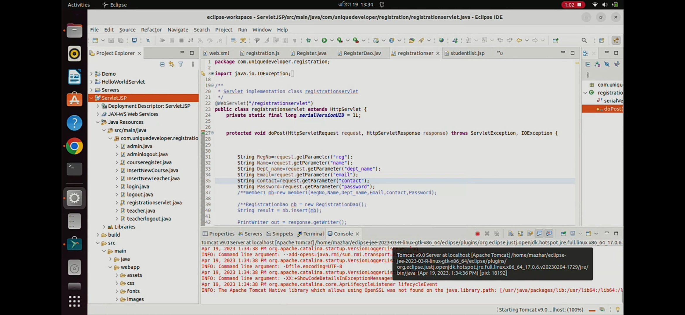

### Student Profile
1. **Sign In**  
   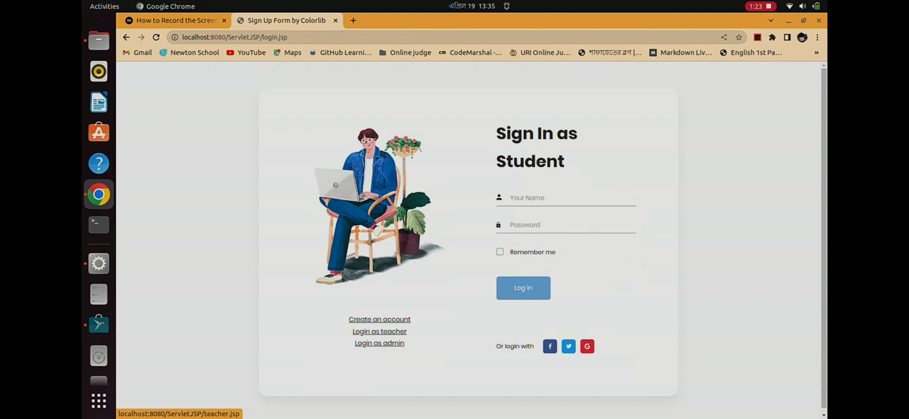
2. **Sign Up**  
   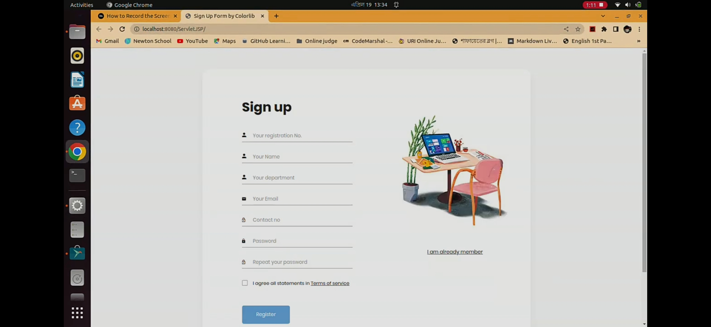
3. **Profile**  
   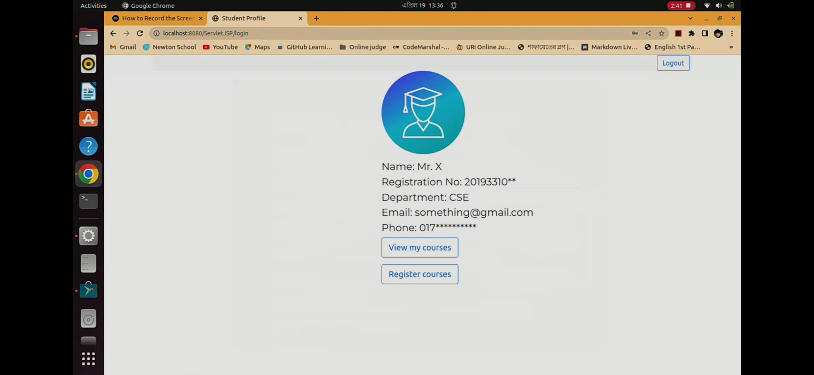
4. **Registered Courses**  
   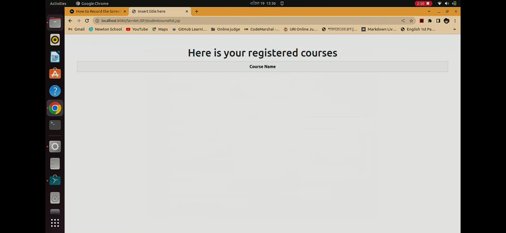
5. **Register New Course**  
   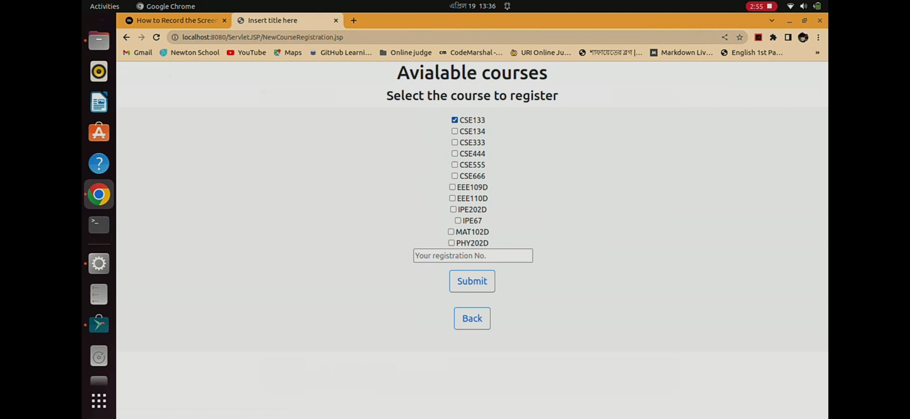
6. **Registration Completed**  
   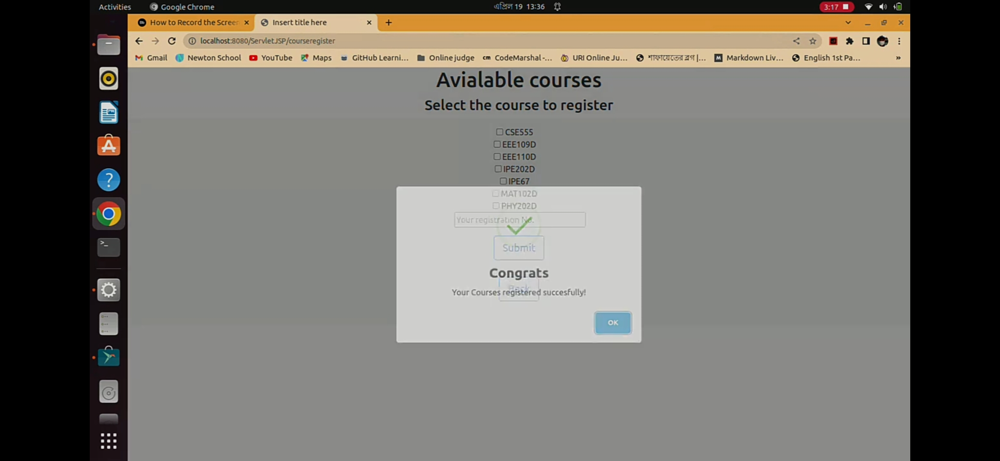
7. **After Registration**  
   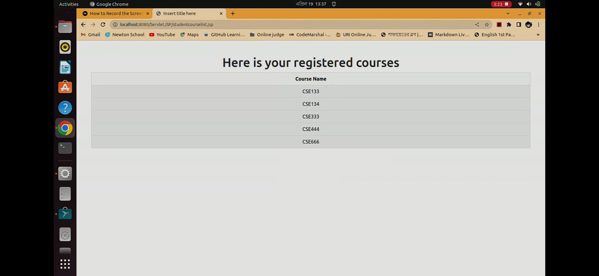

### Teacher Profile
1. **Sign In**  
   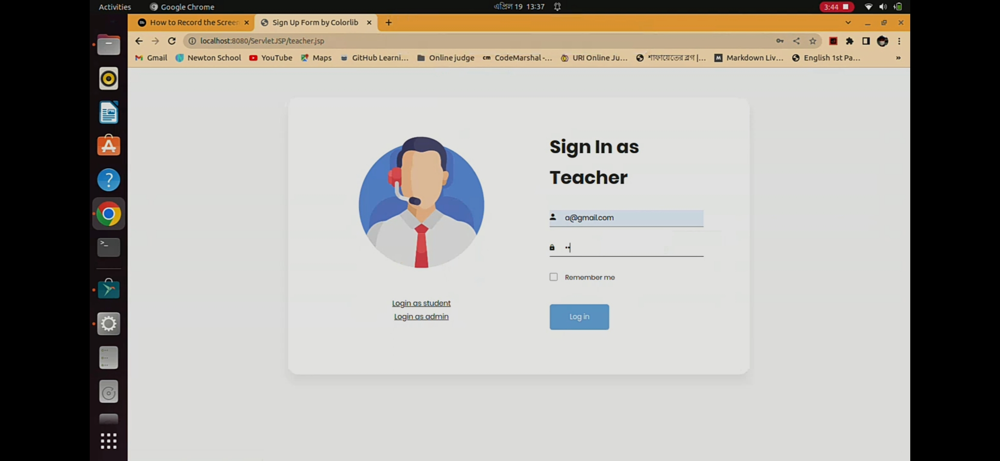
2. **Profile**  
   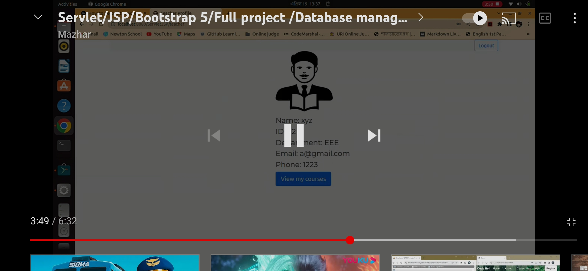
3. **Course-Wise Student List**  
   

### Admin Profile
1. **Sign In**  
   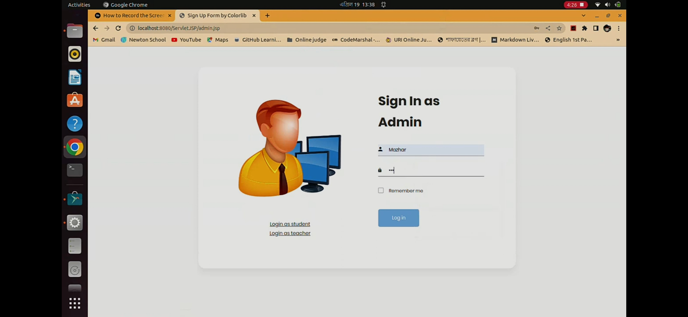
2. **Profile**  
   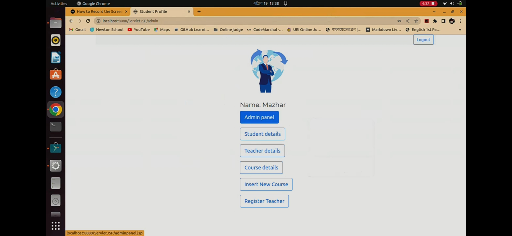
3. **Admin List**  
   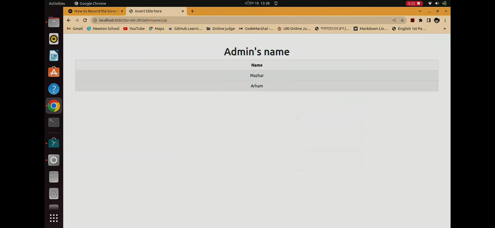
4. **Student List**  
   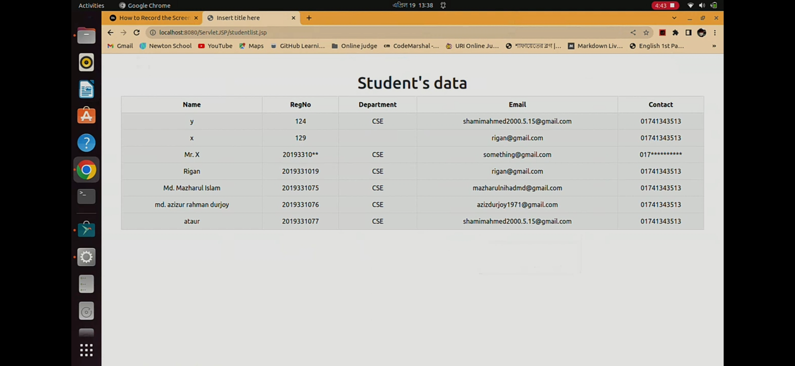
5. **Course List**  
   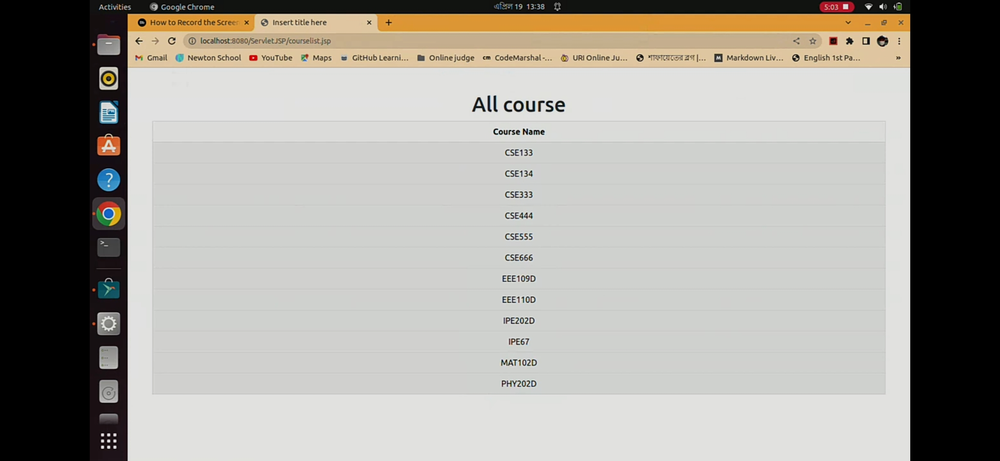
6. **Add New Course**  
   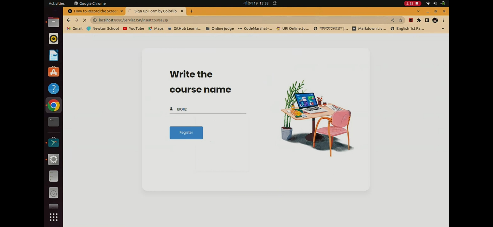
7. **Register New Teacher**  
   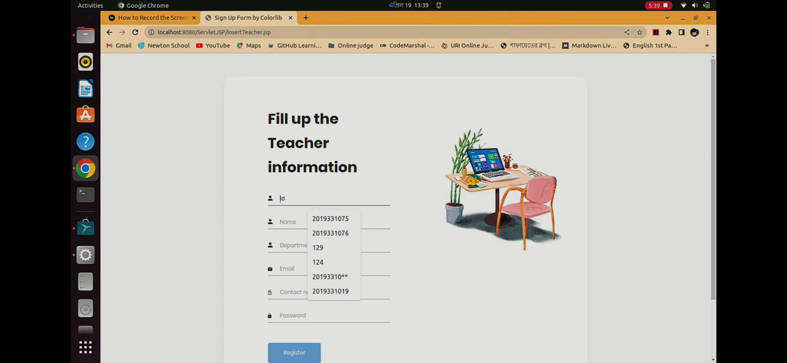

---

## Objectives
The project was completed as part of **CSE-446 Web Engineering Lab (Lab 3: Servlet Project)** with the following objectives:

1. Develop a website entirely using Servlet and JSP.
2. Simulate the functionalities of an online course management system.
3. Enhance the website's interface using Bootstrap or similar JS frameworks.
4. Integrate a backend database (MySQL or NoSQL) for dynamic data storage and management.

### Functional Requirements
- **R-1:** Handle three user roles: student, teacher, admin.
- **R-2:** Authenticate users with username and password.
- **R-3:** Allow admins to add courses and assign teachers to courses.
- **R-4:** Enable students to register for courses and view their registered courses.
- **R-5:** Allow teachers to view their courses and access student lists for each course.

---

## Evaluation Criteria
The project was evaluated based on the following criteria:
- **Requirement Fulfillment:** 5 x 5 = 25 marks
- **Design & Aesthetics:** 10 marks
- **Code Documentation:** 5 marks
- **Q&A During Showcasing:** 10 marks

**Total Marks:** 50

---

## Submission
The project was showcased to the instructor on a group basis, where all members contributed equally. A rigorous Q&A session was conducted during the showcasing, and all members were expected to answer questions related to their contributions.

---

**Markdown Source:** You can download or copy this text for use in any Markdown-supported platform.
